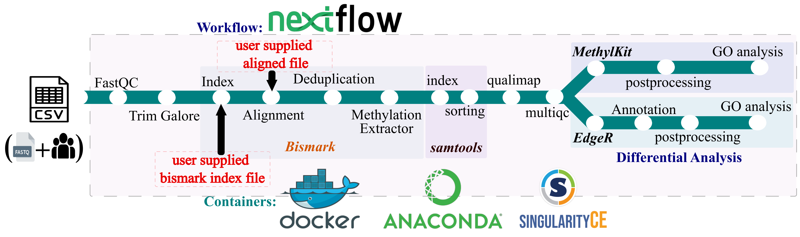

<p align="center">
  
</p>


<p align="center">
  <a href="https://www.nextflow.io/"></a>
  <a href="https://doi.org/10.5281/zenodo.14204260"></a>
  <a href="https://jd2112.github.io/milou/"></a>
  <a href="https://www.nvidia.com/en-us/clara/genomics/"></a>
  <a href="LICENSE"></a>
</p>

<p align="center">
  <a href="https://hub.docker.com/"></a>
  <a href="https://docs.sylabs.io/guides/latest/user-guide/"></a>
  <a href="https://docs.conda.io/"></a>
  <a href="https://slurm.schedmd.com/"></a>
</p>


## 1. Overview

**milou** (**M**ethylation **I**ntegrated **L**ayer for **O**mics **U**nification) is a high-performance Nextflow DSL2 pipeline designed for end-to-end DNA methylation profiling. It features a versatile, dual-engine architecture that seamlessly handles diverse library preparations and conversion chemistries—including targeted hybrid capture (**Twist Human Methylome NGS panels**), **Enzymatic Methyl-seq (EM-seq)**, and traditional **Whole-Genome Bisulfite Sequencing (WGBS)**—while offering specialized dual-track processing modes for both GPU-accelerated (NVIDIA Clara Parabricks) and CPU-based (Bismark) execution.

A core scientific breakthrough of milou is its **Multi-Method Differential Methylation Consensus Framework**, which statistically reconciles calls across three complementary methodologies (**DSS**, **edgeR**, and **methylKit**) using a multi-method composite $\pi$-value score alongside an automated, publication-ready **Quarto Reporting Engine** (interactive HTML + vector PDF).

> [!NOTE]
> For a deeper look at our design goals, competitive positioning, and scientific rationale, please see our [Project Philosophy](PHILOSOPHY.md) and our [Benchmarking Strategy](BENCHMARKING.md).


<p align="center">
  
</p>

## 2. Key Features

- **Dual-Engine Execution (GPU + CPU)**: Flexible support for ultra-fast GPU-accelerated processing via NVIDIA Clara Parabricks (`fq2bam_meth` + `MethylDackel`) and standard CPU-based workflows (Bismark with parallel FastQ chunking), achieving bitwise concordance across platforms.
- **Versatile Conversion Chemistry**: Native support for Enzymatic Methyl-seq (EM-seq), targeted hybrid capture (e.g., Twist Human Methylome), and standard WGBS bisulfite conversion.
- **Multi-Method Consensus Layer ($\pi$-Value)**: Directly addresses the notorious caller discordance between beta-binomial models (DSS), negative binomial generalized linear models (edgeR), and logistic regression (methylKit) by ranking candidate genes via composite $\pi$-score: $\pi_g = \overline{|\log_2(\text{FC})_g|} \times (-\log_{10}(P_{\min,g}))$.
- **Automated Clinical & Research Quarto Reports**: Interactive HTML dashboards (with searchable `DT::datatable`, TSV/Excel exports, and locus zoom plots) and publication-ready vector PDFs produced automatically via Quarto.
- **Genomic & Disease Annotation**: Direct integration with gnomAD population variant frequencies, OMIM morbid maps, and localized DisGeNET disease descriptors.
- **Biological Pathway Integration**: Automated functional profiling including Gene Ontology (GO) and KEGG pathway mapping with automated Pathview overlay diagrams.
- **Strict Clinical Governance & Determinism**: Cryptographic SHA256 input checksumming, HIPAA-compliant PHI sanitization, automated conversion efficiency QC (Lambda spike-in), and bitwise statistical determinism (`set.seed(42)`).
- **FAIR Open Science Archive (Zenodo)**: Complete execution reports, timelines, MultiQC dashboards, and benchmark assets are permanently deposited on Zenodo at **DOI: [10.5281/zenodo.22326688](https://doi.org/10.5281/zenodo.22326688)**.

## 3. Pipeline Architecture

| Step | CPU Track (Bismark) | GPU Track (NVIDIA Parabricks) |
| :--- | :--- | :--- |
| **Raw QC** | [FastQC](https://www.bioinformatics.babraham.ac.uk/projects/fastqc/) | [FastQC](https://www.bioinformatics.babraham.ac.uk/projects/fastqc/) |
| **Adapter Trimming** | [Trim Galore](https://www.bioinformatics.babraham.ac.uk/projects/trim_galore/) | [Trim Galore](https://www.bioinformatics.babraham.ac.uk/projects/trim_galore/) |
| **Alignment & Dedup** | [Bismark](http://felixkrueger.github.io/Bismark/) (Multi-core split/merge) | [Parabricks](https://www.nvidia.com/en-us/clara/genomics/) (`fq2bam_meth`) |
| **Sorting & Indexing** | [Samtools](http://www.htslib.org/) | Included in Parabricks |
| **Methylation Extraction** | [Bismark Methylation Extractor](http://felixkrueger.github.io/Bismark/) | [MethylDackel](https://github.com/dpryan79/MethylDackel) |
| **Alignment & Target QC** | [Qualimap](http://qualimap.conesalab.org/) / [Picard HsMetrics](https://broadinstitute.github.io/picard/) | [Qualimap](http://qualimap.conesalab.org/) / [Picard HsMetrics](https://broadinstitute.github.io/picard/) |
| **Multi-Method DMC/DMR** | [DSS](https://bioconductor.org/packages/DSS/) / [edgeR](https://bioconductor.org/packages/edgeR/) / [methylKit](https://bioconductor.org/packages/methylKit/) | [DSS](https://bioconductor.org/packages/DSS/) / [edgeR](https://bioconductor.org/packages/edgeR/) / [methylKit](https://bioconductor.org/packages/methylKit/) |
| **Consensus Layer** | Multi-method $\pi$-value scoring + majority voting | Multi-method $\pi$-value scoring + majority voting |
| **Functional Enrichment** | [clusterProfiler](https://bioconductor.org/packages/clusterProfiler/) (GO, KEGG, Pathview, DisGeNET) | [clusterProfiler](https://bioconductor.org/packages/clusterProfiler/) (GO, KEGG, Pathview, DisGeNET) |
| **Clinical Quarto Report** | Integrated Quarto engine (HTML & vector PDF) | Integrated Quarto engine (HTML & vector PDF) |


## 4. Requirements & Installation

- **Nextflow**: Version `>= 21.10.3` (tested on 25.10.5)
- **Container Engine**: [Docker](https://docs.docker.com/engine/install/) or [Singularity](https://singularity-tutorial.github.io/01-installation/) (all images pinned with immutable SHA256 digests)
- **Java**: JRE `>= 11` (or OpenJDK 17)
- **Hardware**:
  - **CPU Track**: Minimum 16 CPU cores and 64 GB RAM recommended for targeted panels; $\ge$ 128 GB RAM recommended for human whole-genome sequencing (WGBS / EM-seq).
  - **GPU Track**: NVIDIA CUDA-capable GPU with $\ge$ 16 GB VRAM (e.g., A10, A30, A100, L40S).

## 5. Quick Start

### A. Prepare Sample Sheet (`Sample_sheet.csv`)
```csv
sample_id,group,read1,read2
SRR36563094,asthmatic,data/sample1_R1.fastq.gz,data/sample1_R2.fastq.gz
SRR36563095,asthmatic,data/sample2_R1.fastq.gz,data/sample2_R2.fastq.gz
SRR36563098,healthy,data/sample3_R1.fastq.gz,data/sample3_R2.fastq.gz
SRR36563099,healthy,data/sample4_R1.fastq.gz,data/sample4_R2.fastq.gz
```

### B. High-Speed GPU Track (NVIDIA Parabricks)
```bash
nextflow run JD2112/milou \
    -profile singularity,gpu \
    --sample_sheet Sample_sheet.csv \
    --genome_fasta /data/genomes/GRCh38/Homo_sapiens.GRCh38.fa \
    --gtf_file /data/genomes/GRCh38/Homo_sapiens.GRCh38.104.gtf \
    --refseq_file /data/genomes/GRCh38/hg38_RefSeq.bed.gz \
    --diff_meth_method all \
    --mode clinical \
    --outdir results_gpu
```

### C. Standard CPU Track (Bismark)
```bash
nextflow run JD2112/milou \
    -profile singularity \
    --sample_sheet Sample_sheet.csv \
    --genome_fasta /data/genomes/GRCh38/Homo_sapiens.GRCh38.fa \
    --gtf_file /data/genomes/GRCh38/Homo_sapiens.GRCh38.104.gtf \
    --refseq_file /data/genomes/GRCh38/hg38_RefSeq.bed.gz \
    --diff_meth_method all \
    --mode clinical \
    --outdir results_cpu
```

## 6. Pre-Configured Benchmark Profiles & Public Datasets

milou natively integrates an automated data-staging subworkflow (`PRE_STAGE`) that streams and verifies raw FASTQ reads and reference genomes directly from public archives (ENA, NCBI SRA) via URL-parameterized manifests, eliminating manual pre-downloading overhead.

### Evaluated Public Datasets

| Modality | Public Accession / Source | Reference Genome | Cohort & Experimental Design | Pre-Configured Profiles |
| :--- | :---: | :---: | :--- | :--- |
| **Targeted Hybrid-Capture**<br>(Twist Human Methylome) | [ENA PRJEB61787](https://www.ebi.ac.uk/ena/browser/view/PRJEB61787)<br>*(Krumpolec et al., 2024)* | `hg19` / `GRCh37` | 24 samples: Maternal peripheral blood (12) and umbilical cord blood (12); vaginal delivery vs. caesarean section | `-profile twist_minimal_cpu`<br>`-profile twist_minimal_gpu`<br>`-profile twist_replicate_article_A_cpu`<br>`-profile twist_replicate_article_B_cpu`<br>`-profile twist_full_cpu` |
| **Enzymatic Methyl-seq**<br>(Whole-Genome EM-seq) | [NCBI SRA PRJNA1392513](https://www.ncbi.nlm.nih.gov/bioproject/PRJNA1392513) | `hg38` / `GRCh38` | 12 samples: Human respiratory cohort (4 asthmatic, 4 atopic, 4 healthy controls; all-vs-all contrast design) | `-profile test_emseq_cpu`<br>`-profile test_emseq_gpu` |
| **Bisulfite Sequencing**<br>(Full-Depth WGBS) | [NCBI SRA PRJNA476128](https://www.ncbi.nlm.nih.gov/bioproject/PRJNA476128)<br>*(Fetahu et al., 2019)* | `hg38` / `GRCh38` | 45 samples (6-sample benchmark subset): Postmortem human brain tissue (wild-type vs. early-onset AD vs. late-onset AD) | `-profile test_bisulfite_cpu`<br>`-profile test_bisulfite_gpu` |

### Rapid Execution Commands

You can execute any of these benchmark cohorts directly from GitHub. `milou` will automatically download the remote FASTQs, test gzip integrity, stage reference assets, and execute the complete analytical cascade:

```bash
# 1. Minimal Targeted Capture Sanity Test (6 samples, hg19)
nextflow run JD2112/milou -r main -profile twist_minimal_cpu,singularity --outdir ./results_twist_min

# 2. Human Whole-Genome EM-seq Benchmark (12 samples, hg38)
nextflow run JD2112/milou -r main -profile test_emseq_cpu,singularity --outdir ./results_emseq_cpu
nextflow run JD2112/milou -r main -profile test_emseq_gpu,singularity,gpu --outdir ./results_emseq_gpu

# 3. Whole-Genome Bisulfite Sequencing Benchmark (6 samples, hg38)
nextflow run JD2112/milou -r main -profile test_bisulfite_cpu,singularity --outdir ./results_wgbs_cpu
nextflow run JD2112/milou -r main -profile test_bisulfite_gpu,singularity,gpu --outdir ./results_wgbs_gpu

# 4. Twist Full Clinical Cohort Replication (Cohort A maternal blood: 12 samples, hg19)
nextflow run JD2112/milou -r main -profile twist_replicate_article_A_cpu,singularity --outdir ./results_twist_A
```

## 7. Key Parameter Reference

| Parameter | Description | Default |
| :--- | :--- | :---: |
| `--sample_sheet` | Path to sample sheet CSV (**required**) | `null` |
| `--genome_fasta` | Path to reference genome FASTA | `null` |
| `--bismark_index` | Pre-built Bismark bisulfite index directory | `null` |
| `--gtf_file` | Ensembl gene annotation GTF (for edgeR / feature overlap) | `null` |
| `--refseq_file` | RefSeq gene coordinates BED (for methylKit / promoter overlap) | `null` |
| `--diff_meth_method` | Differential callers to run: `all`, `dss`, `edger`, `methylkit` | `'dss'` |
| `--smoothing` | Spline smoothing in DSS (`TRUE` / `FALSE`; use `FALSE` for WGBS memory scaling) | `TRUE` |
| `--mode` | Operational mode: `research` (broad exploratory) or `clinical` (strict consensus voting) | `'research'` |
| `--run_clinical_report` | Render automated Quarto HTML & PDF diagnostic reports | `false` |
| `--coverage_threshold` | Minimum CpG read depth filter | `3` |
| `--logfc_cutoff` | Effect size threshold for significance filter | `0.5` |
| `--pvalue_cutoff` | P-value threshold for candidate significance filter | `0.05` |
| `--outdir` | Output publication directory | `'./results'` |

> For the exhaustive parameter specification, visit the [Online Documentation](https://jd2112.github.io/milou/parameters/).

## 8. Output Directory Structure

Each pipeline run organizes harmonized results into modular directories depending on the execution track (GPU via NVIDIA Clara Parabricks or CPU via Bismark):

| Directory | Description |
| :--- | :--- |
| `read_processing/` | Quality control (FastQC), adapter trimming (Trim Galore), and sync checks |
| `parabricks_analysis/` | *(GPU track)* Clara Parabricks alignment (`fq2bam_meth`), indexing, and MethylDackel |
| `bismark_analysis/` | *(CPU track)* Bismark directional alignment, deduplication, and methylation extractor |
| `prepare_genome/` | *(CPU track)* In silico bisulfite genome conversion |
| `conversion_qc/` | Automated conversion efficiency check (`conversion_status.txt`) |
| `differential_methylation/` | Caller-specific statistics (`dss_analysis/`, `edger_analysis/`, `methylkit_analysis/`) |
| `result_analysis/` | Method-specific feature annotation, GO/KEGG functional profiling, and post-processing |
| `unified_layer/` | Cross-method consensus voting matrix and ranked $\pi$-score candidates |
| `clinical_reporting/` | Clinical annotation (OMIM, gnomAD), DisGeNET disease enrichment, and locus plots |
| `report/` | Automated Quarto summary reports (`milou_report.html` and publication-ready `.pdf`) |
| `multiqc/` | Aggregated MultiQC quality control report (`milou-Analysis-Report_multiqc_report.html`) |
| `pipeline_info/` | Nextflow execution telemetry (resource utilization trace, timeline, HTML DAG) |

<details>
<summary><b>🔍 Click to expand GPU Output Directory Tree (<code>results_test_emseq_gpu/</code>)</b></summary>

```text
results_test_emseq_gpu/
├── clinical_reporting/
│   ├── clinical_annotation/
│   ├── disease_enrichment/
│   ├── dmr_detail_plot/
│   ├── go_enrichment/
│   ├── kegg_enrichment/
│   ├── pathview_plot/
│   └── pca_plot/
├── conversion_qc/
│   └── conversion_status.txt
├── differential_methylation/
│   ├── dss_analysis/
│   ├── edger_analysis/
│   └── methylkit_analysis/
├── multiqc/
│   ├── milou-Analysis-Report_multiqc_report_data/
│   ├── milou-Analysis-Report_multiqc_report.html
│   ├── multiqc.log
│   └── versions.yml
├── parabricks_analysis/
│   ├── bwameth_index/
│   ├── methyldackel_extract/
│   ├── parabricks_fq2bammeth/
│   ├── qualimap/
│   ├── samtools_faidx/
│   └── samtools_index/
├── pipeline_info/
│   ├── execution_report.html
│   ├── execution_timeline.html
│   ├── execution_trace.txt
│   └── pipeline_dag.html
├── read_processing/
│   ├── checksum_verify/
│   ├── fastqc/
│   ├── trim_galore/
│   └── validate_sync/
├── report/
│   ├── milou_report.html
│   └── milou_report.pdf
├── result_analysis/
│   ├── annotate_results_dss/
│   ├── annotate_results_edger/
│   ├── enrichment_analysis_dss/
│   ├── enrichment_analysis_edger/
│   ├── enrichment_analysis_methylkit/
│   ├── post_processing_dss/
│   ├── post_processing_edger/
│   └── post_processing_methylkit/
└── unified_layer/
    └── results_dir/
```

</details>

<details>
<summary><b>🔍 Click to expand CPU Output Directory Tree (<code>results_test_emseq_cpu/</code>)</b></summary>

```text
results_test_emseq_cpu/
├── bismark_analysis/
│   ├── bismark_align/
│   ├── bismark_deduplicate/
│   ├── bismark_methylation_extractor/
│   ├── bismark_report/
│   ├── qualimap/
│   ├── samtools_index/
│   ├── samtools_merge/
│   └── samtools_sort/
├── clinical_reporting/
│   ├── clinical_annotation/
│   ├── disease_enrichment/
│   ├── dmr_detail_plot/
│   ├── go_enrichment/
│   ├── kegg_enrichment/
│   ├── pathview_plot/
│   └── pca_plot/
├── conversion_qc/
│   └── conversion_status.txt
├── differential_methylation/
│   ├── dss_analysis/
│   ├── edger_analysis/
│   └── methylkit_analysis/
├── multiqc/
│   ├── milou-Analysis-Report_multiqc_report_data/
│   ├── milou-Analysis-Report_multiqc_report.html
│   ├── multiqc.log
│   └── versions.yml
├── pipeline_info/
│   ├── execution_report.html
│   ├── execution_timeline.html
│   ├── execution_trace.txt
│   └── pipeline_dag.html
├── prepare_genome/
│   └── bismark_genome_preparation/
├── read_processing/
│   ├── checksum_verify/
│   ├── fastqc/
│   ├── trim_galore/
│   └── validate_sync/
├── report/
│   ├── milou_report.html
│   └── milou_report.pdf
├── result_analysis/
│   ├── annotate_results_dss/
│   ├── annotate_results_edger/
│   ├── enrichment_analysis_dss/
│   ├── enrichment_analysis_edger/
│   ├── enrichment_analysis_methylkit/
│   ├── post_processing_dss/
│   ├── post_processing_edger/
│   └── post_processing_methylkit/
└── unified_layer/
    └── results_dir/
```

</details>

## 9. Citation & Reproducibility

If you use milou in your research, please cite:

> **Das, J., et al. (2026).** *milou: An open-source, reproducible Nextflow framework for high-throughput DNA methylation profiling with multi-method consensus scoring and automated reporting.*   
> **Software Pipeline Archive:** [https://doi.org/10.5281/zenodo.14204260](https://doi.org/10.5281/zenodo.14204260)  
> **Benchmark Data Archive:** [https://doi.org/10.5281/zenodo.22326688](https://doi.org/10.5281/zenodo.22326688)

## 10. License & Acknowledgements

This project is licensed under the **MIT License** - see the [LICENSE](LICENSE) file for details.

The authors would like to acknowledge Dr. Vesa Loitto, the Core Facility, Dept. of Biomedical and Clinical Sciences, Faculty of Medicine and Health Sciences at Linköping University, Sweden for his support on this application development. We would like to acknowledge the Core Facility, Faculty of Medicine and Health Sciences, Linköping University, Linköping, Sweden and Clinical Genomics Linköping, Science for Life Laboratory, Sweden for their support. We thank the PDC (Parallelldatorcentrum) Center for High-Performance Computing, KTH Royal Institute of Technology, Sweden, for providing access to the computing resources and storage used in this research. We thank ALF funding support from Region Östergötland (RÖ) and Genomic Medicine Sweden for the computational facility. Clinical Genomics Linköping receives funding from the Science for Life Laboratory.


